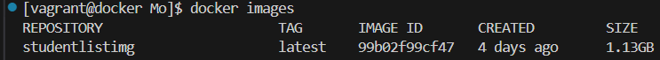
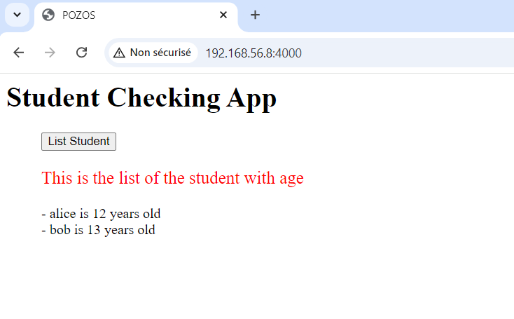
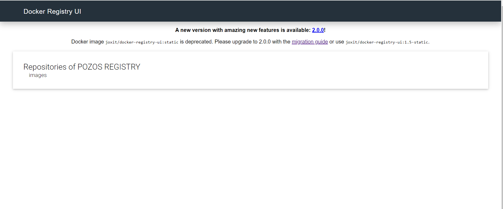

## Docker student-list<br>[](https://github.com/MozkaGit/docker-student-list/actions/workflows/registry.yaml)

Ce mini projet a pour but de containeuriser une application écrite en python et ensuite de la déployer sur docker avec un frontend en php et un backend en python qui tourne sur Flask.

L'application en question nommée StudentList, permet de lister l'ensemble des étudiants d'une école.

La réalisation de ce projet va se faire en 3 grandes parties.


### Partie 1 - Dockerfile Rédaction du Dockerfile et création de l'image

#### Etape 1 - Dockerfile Rédaction du Dockerfile et création de l'image


Avec les commandes suivantes :

[Les instructions du Dockerfile à renseigner](https://github.com/linanzouechim/docker-student-list/blob/master/simple_api/Dockerfile)

```
git clone https://github.com/diranetafen/student-list.git
cd student_list/simple_api/
vi Dockerfile
docker build  -t studentListimg .
```

Voici le résultat:




#### Étape 2: Démarrage et test du containeur

Lancement du containeur avec les paramètres appropriés:

`docker run  -it --name test -v ${PWD}/student_age.json:/data/student_age.json -p 4004:5000 studentlistimg`

#### Etape 3: Test de l'application

`curl -u toto:python -X GET http://<host IP>:<API exposed port>/pozos/api/v1.0/get_student_ages`


### Partie 2: Infrastructure as code avec Docker-Compose

[Les instructions du Dockerfile à renseigner](https://github.com/linanzouechim/docker-student-list/blob/master/docker-compose.yml)
```
docker-compose up -d 
```


Notre application fonctionne bie avec son interface:




### Partie 3 - Registre privé

Pour cette partie nous allons utiliser 2 images déjà créés:

1. Pour la création du registre il existe une [image officielle](https://hub.docker.com/_/registry) au nom éponyme.
2. Pour l'interface utilisateur du registre privé nous allons utilisr l'image [joxit/docker-registry-ui](https://hub.docker.com/r/joxit/docker-registry-ui).

#### Étape 1: Création des conteneurs

Créons d'abord un réseau pour nos conteneurs:
`docker network create registry-network`

Maintenant il est temps de les créer:
`docker run -d -p 5000:5000 --name registry-pozos --network docker-student-list_student_network registry:2`

`docker run -d --network docker-student-list_student_network -p 4010:80 -e REGISTRY_TITLE="POZOS REGISTRY" -e REGISTRY_URL="registry-pozos:5000" -e DELETE_IMAGES=true joxit/docker-registry-ui:static`

Vérifions que nous avons accès au registre via l'interface web:



#### Étape 2: Push de l'image dans le registre privé

1. Avec un `docker image` il faut récupérer le nom ou l'ID de notre image afin de la tagger:

2. `docker image tag studentlistimg localhost:5000/studentlistimg:1`

3. Passons maintenant au push de l'image:

`docker push localhost:5000/studentlistimg:1`

